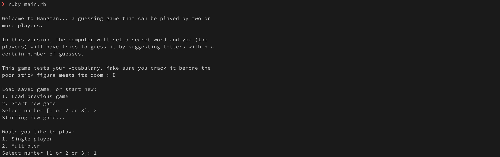
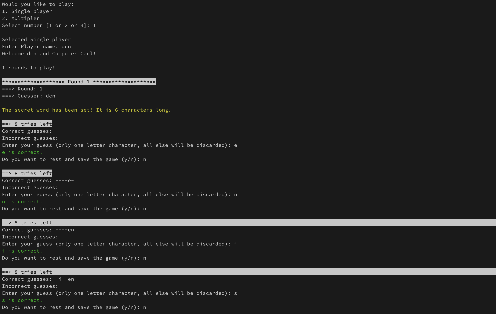
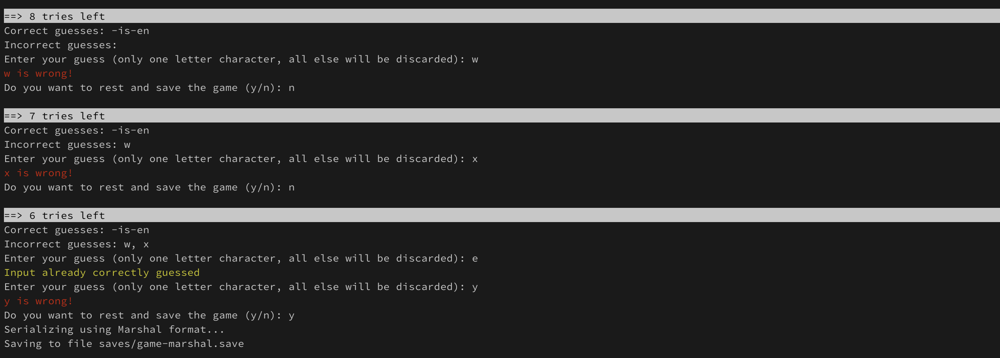
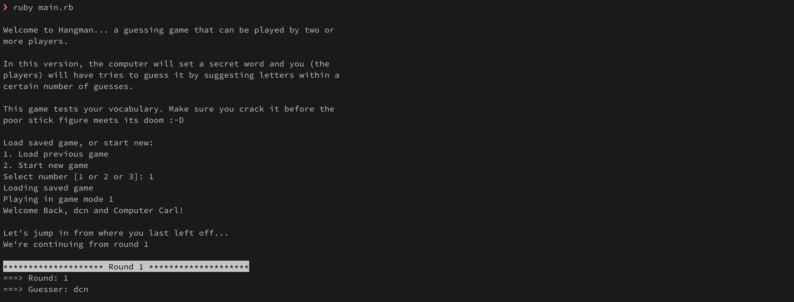
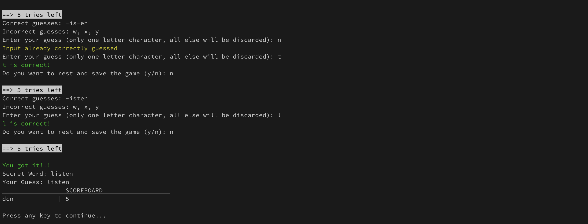

# Project: Hangman
Following the [TOP (The Odin Project)](https://www.theodinproject.com/lessons/ruby-hangman) course and creating the hangman game to practice my skills in Ruby files and serialization.
> You will be building a command line Hangman game where one player plays against the computer, but a bit more advanced.

## Table of Contents
- [Installation](#installation)
- [Usage](#usage)
- [Examples](#examples)
- [Contributing](#contributing)
- [License](#license)

## Installation
1. Clone the repository:
```bash
 git clone https://github.com/otherdcn/top_hangman.git
```

2. Install dependencies:
```bash
 bundle install
 ```

## Usage
Use the following command to run the application
- from the __root__ folder:
```bash
ruby main.rb
```

## Examples
1. Run the app and choose the settings for the game: play a saved game, or start a new game.

2. Then the guesser can go ahead and start typing guesses.

3. After every try, correct or incorrect, the game will ask to save: simply enter y/n.

4. After coming back and opening a save, the game will continue from where you left off.

5. Guesser is successful if they can guess the full word before the __proverbial stick man__ is hanged.


## Contributing
If you feel the need to try it out and perhaps contribute:
1. Fork the repository.
2. Create a new branch: `git checkout -b feature-name`.
3. Make your changes.
4. Push your branch: `git push origin feature-name`.
5. Create a pull request.

 ## License
 This project is licensed under the [MIT License](LICENSE).
